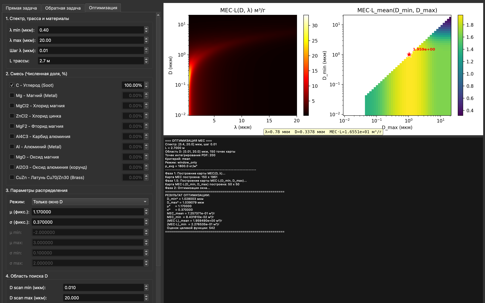

# mie-shield

Mie scattering calculator for extinction, MEC, and transmission in airborne particle mixtures.

`mie-shield` is a desktop GUI for estimating optical attenuation by dispersed particles using Mie theory. It calculates extinction cross sections, attenuation coefficients, optical depth, transmittance, and mass extinction coefficient (MEC) for monodisperse and polydisperse mixtures.

The application is intended for engineering and experimental analysis of aerodisperse particle media: soot, metals, salts, oxides, and mixed particles with user-defined number fractions.



## Download

Pre-built binaries for macOS (arm64) and Windows (x64) are attached to each [GitHub Release](../../releases). Linux is not packaged – run from source instead (see [Running](#running)).

## Features

- Forward Mie calculation for monodisperse particles.
- Forward Mie calculation for log-normal and custom log-normal-like particle-size distributions.
- Mixtures of several particle materials by number fraction.
- Mass or number concentration input.
- Configurable measurement path length `L`.
- Spectral calculations over a wavelength range.
- Inverse diameter search from a target `MEC`, `alpha`, `tau`, `T_eff`, or `AVG T`.
- Optimization of a custom particle-size distribution window for maximum `MEC * L`.
- Export of forward, inverse, and optimization results to text files.

## Materials

The built-in material database currently includes:

| Code | Material |
| --- | --- |
| `C` | carbon soot |
| `Mg` | magnesium |
| `MgCl2` | magnesium chloride |
| `ZnCl2` | zinc chloride |
| `MgF2` | magnesium fluoride |
| `Al4C3` | aluminum carbide |
| `Al` | aluminum |
| `MgO` | magnesium oxide |
| `Al2O3` | alumina / corundum |
| `CuZn` | Cu70/Zn30 brass |

Optical constants are documented in [complex-refractive-indices.md](complex-refractive-indices.md). Some materials use literature-based models, while others use approximate reconstructed models where complete measured `n(lambda), k(lambda)` tables are unavailable. Treat approximate materials accordingly.

## Running

The Python application runs on any platform supported by its dependencies (PySide6, NumPy, SciPy, Matplotlib, PyMieScatt). The project uses [`uv`](https://docs.astral.sh/uv/) and pins Python 3.14:

```bash
uv sync --locked --group dev
uv run --locked python mie_shield.py
```

The main window has three calculation tabs:

- Forward problem (`Прямая задача`)
- Inverse problem (`Обратная задача`)
- Optimization (`Оптимизация`)

## Packaging

Binary builds are produced and tested only for macOS (arm64) and Windows (x64). Build tools are kept out of the runtime dependencies; packaging uses Nuitka inside a local environment created by the scripts under `scripts/`. Generated artifacts are written to `dist/`.

### macOS DMG

Requirements: macOS on the target architecture, `uv`, Python 3.14, Xcode Command Line Tools (`clang`, `codesign`, `hdiutil`).

```bash
./scripts/package-macos.sh
```

Output: `dist/MieShield-<version>-macos-arm64.dmg`. If `icon.png` is present, it is embedded as the app icon. The script honors `PYTHON_VERSION`, `ARCH`, and `PRODUCT_NAME` env vars.

### Windows ZIP

Requirements: Windows, `uv`, Python 3.14, Microsoft C++ Build Tools.

```powershell
.\scripts\package-windows.ps1
```

Output: `dist/MieShield-<version>-windows-x64.zip`.

### Releases

Pushing a `v*` tag triggers the `Build release artifacts` workflow, which builds both artifacts and attaches them to the GitHub Release.

The Windows build disables Nuitka link-time optimization by default because the
MSVC linker can run out of heap when compiling the PySide6, Matplotlib, SciPy,
and NumPy standalone bundle. If your build machine handles it, you can opt in:

```powershell
.\scripts\package-windows.ps1 -Lto yes
```

## Core Quantities

For monodisperse particles, the main quantities are:

```text
Cext = Qext * pi * D^2 / 4
alpha = N * Cext
tau = alpha * L
T = exp(-tau)
MEC = alpha / rho_mass
```

where:

- `D` is particle diameter.
- `Qext` is the Mie extinction efficiency.
- `Cext` is extinction cross section.
- `N` is number concentration.
- `rho_mass` is mass concentration in `g/m^3`.
- `L` is the measurement path length in meters.
- `tau` is optical depth.
- `T` is transmittance.
- `MEC` is mass extinction coefficient in `m^2/g`.

For wavelength ranges, the app reports both:

- `AVG T = mean(exp(-alpha_i * L))`
- `T_eff = exp(-mean(alpha_i * L))`

These are not the same in general. Use `AVG T` when the experimental observable is an arithmetic average of spectral transmittance. Use `T_eff` when the observable is represented by an effective optical depth.

## Limitations

- Particles are modeled as spheres using Mie theory.
- Mixture entries are treated as number-fraction weights and normalized internally.
- Some refractive-index models are approximate; see the optical-constant documentation before using results as publication-grade material constants.
- The optimization tab maximizes the selected model metric. It does not infer a unique physical particle-size distribution from experimental data.

## License

MIT – see [LICENSE](LICENSE).
