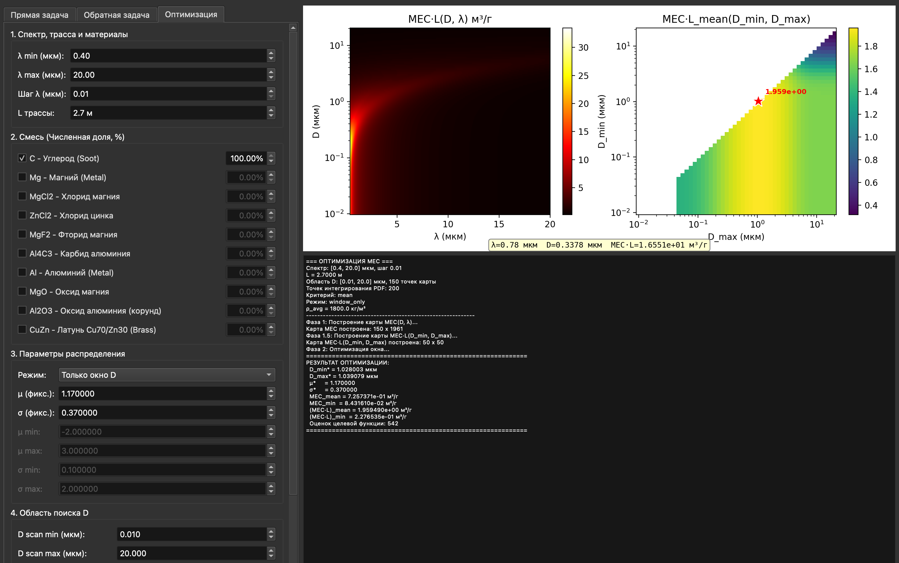

# mie-shield

Mie scattering calculator for extinction, MEC, and transmission in airborne particle mixtures.

`mie-shield` is a desktop GUI for estimating optical attenuation by dispersed particles using Mie theory. It calculates extinction cross sections, attenuation coefficients, optical depth, transmittance, and mass extinction coefficient (MEC) for monodisperse and polydisperse mixtures.

The application is intended for engineering and experimental analysis of aerodisperse particle media: soot, metals, salts, oxides, and mixed particles with user-defined number fractions.



## Download

Pre-built binaries for macOS (arm64), Windows (x64), and Linux (x64) are attached to each [GitHub Release](../../releases).

- macOS: `MieShield-<version>-macos-arm64.dmg`
- Windows: `MieShield.exe`
- Linux: `MieShield-<version>-linux-x64.tar.gz`

You can also run the application from source with `uv` (see [Running](#running)).

## Features

- Forward Mie calculation for monodisperse particles.
- Forward Mie calculation for log-normal and custom log-normal-like particle-size distributions.
- Mixtures of several particle materials by number fraction.
- Mass or number concentration input.
- Configurable measurement path length `L`.
- Spectral calculations over a wavelength range.
- Inverse diameter search from a target `MEC`, `alpha`, `tau`, `T_eff`, or `AVG T`.
- Optimization of a custom particle-size distribution window for maximum `MEC * L`.
- Export of forward, inverse, and optimization results to text files.
- Bilingual desktop UI: English by default, with Russian available from the `Language` menu.

## Materials

The built-in material database currently includes:

| Code | Material | Model quality |
| --- | --- | --- |
| `C` | carbon soot | A – Chang & Charalampopoulos 1990 polynomial |
| `Mg` | magnesium | B – coarse piecewise approximation |
| `MgCl2` | magnesium chloride | B – handbook n_D, no dispersion data |
| `ZnCl2` | zinc chloride | B – DFPT + IR/Raman Lorentz reconstruction |
| `MgF2` | magnesium fluoride | A – Dodge 1984 Sellmeier |
| `Al4C3` | aluminum carbide | C – unverified Sellmeier placeholder |
| `Al` | aluminum | A – Rakić 1998 Lorentz–Drude |
| `MgO` | magnesium oxide | A – Stephens & Malitson 1952 + Hofmeister 2003 IR |
| `Al2O3` | alumina / corundum | A – Malitson & Dodge 1972 Sellmeier |
| `CuZn` | Cu70/Zn30 brass | A – Querry 1985 tabulated n,k |
| `AlF3` | aluminum fluoride (α-AlF₃) | B – Jensen 1970 film visible + DFPT Lorentz IR |
| `AlN` | aluminum nitride (wurtzite) | A/B – Pastrňák 1966 Sellmeier + Kischkat-anchored IR |
| `Ba3N2` | barium nitride | C – Drude placeholder, semimetallic |
| `BaO` | barium oxide | B – Anderson & Hensley 1975 Cauchy + compilation IR |
| `K2CO3` | potassium carbonate (anhydrous) | C – Lorentz reconstruction, no primary spectrum |
| `KAlO2` | potassium aluminate | C – Lorentz reconstruction, no primary spectrum |
| `KCN` | potassium cyanide | B – handbook n_D + CN-stretch Lorentz |
| `MgAl2O4` | magnesium aluminate spinel | A – Tropf & Thomas 1991 Sellmeier |
| `Mg3N2` | magnesium nitride | B – DFT-anchored Lorentz reconstruction |
| `Na2CO3` | sodium carbonate (anhydrous) | C – Lorentz reconstruction, no primary spectrum |
| `NaAlO2` | sodium aluminate | B – DFPT (mp-9212) + HSDB scalars |
| `SrO` | strontium oxide | B – Pynchon & Sieckmann 1966 visible + Jacobson–Nixon IR |
| `TiC` | titanium carbide | A – Pflüger/Palik 1984/1991 tabulated n,k (52 pts) |
| `YSZ` | yttria-stabilized zirconia (12 mol% Y₂O₃) | A – Wood & Nassau 1982 Sellmeier |
| `ZrC` | zirconium carbide | C – Drude+Lorentz, no bulk single-crystal spectrum |
| `ZrO2` | zirconium dioxide (m-ZrO₂, baddeleyite) | B – DFPT (mp-2858) Lorentz reconstruction |

Optical constants are documented in [complex-refractive-indices.md](complex-refractive-indices.md). Some materials use literature-based models, while others use approximate reconstructed models where complete measured `n(lambda), k(lambda)` tables are unavailable. Treat approximate materials accordingly.

## Running

The Python application runs on any platform supported by its dependencies (PySide6, NumPy, SciPy, Matplotlib, PyMieScatt). The project uses [`uv`](https://docs.astral.sh/uv/) and pins Python 3.14:

```bash
uv sync --locked --group dev
uv run --locked python mie_shield.py
```

The main window has three calculation tabs:

- Forward problem
- Inverse problem
- Optimization

## Packaging

Binary builds are produced and tested for macOS (arm64), Windows (x64), and Linux (x64). Build tools are kept out of the runtime dependencies; packaging uses Nuitka inside a local environment created by the scripts under `scripts/`. Generated artifacts are written to `dist/`.

### macOS DMG

Requirements: macOS on the target architecture, `uv`, Python 3.14, Xcode Command Line Tools (`clang`, `codesign`, `hdiutil`).

```bash
./scripts/package-macos.sh
```

Output: `dist/MieShield-<version>-macos-arm64.dmg`. If `icon.png` is present, it is embedded as the app icon. The script honors `PYTHON_VERSION`, `ARCH`, and `PRODUCT_NAME` env vars.

### Windows EXE and ZIP

Requirements: Windows, `uv`, Python 3.14, Microsoft C++ Build Tools.

```powershell
.\scripts\package-windows.ps1
```

Default output: `dist/MieShield-<version>-windows-x64.zip`.

To build a single executable instead of a standalone folder archive:

```powershell
.\scripts\package-windows.ps1 -Mode onefile
```

Onefile output: `dist/windows/MieShield.exe`. This is the Windows artifact published by the release workflow.

### Linux tarball

Requirements: Linux x64, `uv`, Python 3.14, and a working C compiler toolchain.

```bash
./scripts/package-linux.sh
```

Output: `dist/MieShield-<version>-linux-x64.tar.gz`. The archive contains a standalone `mie_shield.dist` folder with the `MieShield` executable and its bundled dependencies. The script honors `PYTHON_VERSION`, `ARCH`, `PRODUCT_NAME`, and `LTO` env vars.

### Releases

Pushing a `v*` tag triggers the `Build release artifacts` workflow, which builds release artifacts and attaches them to the GitHub Release.
Manual workflow runs accept a `release_tag` input, defaulting to `v1.1.1`, and overwrite existing release assets for that tag. The release workflow publishes the macOS DMG, Windows onefile `MieShield.exe`, and Linux x64 tarball. Release notes are resolved automatically from `docs/release-notes-<tag>.md`.

The Windows build disables Nuitka link-time optimization by default because the
MSVC linker can run out of heap when compiling the PySide6, Matplotlib, SciPy,
and NumPy standalone bundle. If your build machine handles it, you can opt in:

```powershell
.\scripts\package-windows.ps1 -Lto yes
.\scripts\package-windows.ps1 -Mode onefile -Lto yes
```

## Core Quantities

For monodisperse particles, the main quantities are:

```text
Cext = Qext * pi * D^2 / 4
alpha = N * Cext
tau = alpha * L
T = exp(-tau)
MEC = alpha / rho_mass
```

where:

- `D` is particle diameter.
- `Qext` is the Mie extinction efficiency.
- `Cext` is extinction cross section.
- `N` is number concentration.
- `rho_mass` is mass concentration in `g/m^3`.
- `L` is the measurement path length.
- `tau` is optical depth.
- `T` is transmittance.
- `MEC` is mass extinction coefficient in `m^2/g`.

For wavelength ranges, the app reports both:

- `AVG T = mean(exp(-alpha_i * L))`
- `T_eff = exp(-mean(alpha_i * L))`

These are not the same in general. Use `AVG T` when the experimental observable is an arithmetic average of spectral transmittance. Use `T_eff` when the observable is represented by an effective optical depth.

## Limitations

- Particles are modeled as spheres using Mie theory.
- Mixture entries are treated as number-fraction weights and normalized internally.
- Some refractive-index models are approximate; see the optical-constant documentation before using results as publication-grade material constants.
- The optimization tab maximizes the selected model metric. It does not infer a unique physical particle-size distribution from experimental data.

## License

MIT – see [LICENSE](LICENSE).
